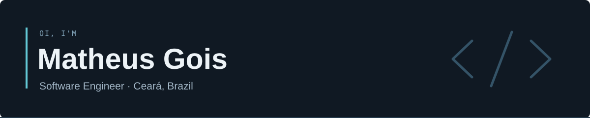

### A little about me

I'm a software engineer from **Ceará, Brazil**. I enjoy figuring out how things work, exchanging ideas, and turning what I learn into something people can use.

Currently a **Mid-Level Software Engineer at AgentShop**, working with full-stack development and AI agents. I graduated in **Systems Analysis and Development at the Federal University of Ceará**.

Lately, I've been spending time with **multi-agent systems, software architecture, and Go**. My background also includes mobile development with React Native.

### Toolbox

**Languages & frameworks**

Ruby · Rails · TypeScript · JavaScript · React · Next.js

**Data & development tools**

PostgreSQL · Redis · Docker · Git · GitHub Actions · Linux

**Also in the mix**

`Sidekiq` · `OpenSearch` · `RSpec` · `React Native`  
`LLM integrations` · `LangChain` · `MCP` · `Multi-agent systems`

**Currently exploring:** Go & software architecture.

### A few things from my corner of GitHub

- [**Lexico**](https://github.com/dev-Gois/lexico) — my take on the word game Termo. [Play it ↗](https://dev-gois.github.io/lexico/)
- [**TaskTrackr**](https://github.com/dev-Gois/TaskTrackr) — a to-do application built with Ruby on Rails.
- [**Python workshop**](https://github.com/dev-Gois/oficina-python-petufc) — workshop materials from PET at UFC Itapajé.

These are some projects from along the way. Most of my current professional work lives in private repositories.

---

**Let's talk.** [LinkedIn ↗](https://www.linkedin.com/in/matheus-gois-37659526b/) · [Email ↗](mailto:mattheusgois@gmail.com)
